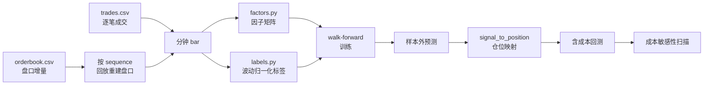

# BTC/USDT 分钟级单标的因子与策略训练方案

> 单交易对、7×24 连续市场、1 分钟 bar、有监督时序预测 + 事件驱动回测。
> 全链路时间基准为 **UTC**，无交易日/收盘概念。

---

## 1. 为什么不用 qlib 的横截面框架

工作区已有 qlib，但它的核心抽象（Alpha158、`RankIC`、`TopkDropoutStrategy`）建立在**多标的横截面排序**上：先给全市场股票打分，再买分数最高的 N 支。

单标的 BTC/USDT 只有时序维度，横截面为 1，因此：

| qlib 组件 | 单标的下的状态 |
|---|---|
| `RankIC` / `Rank ICIR` | 无意义（截面只有一个样本） |
| `TopkDropoutStrategy` | 退化为「满仓 / 空仓」 |
| 行业/市值中性化 | 无对应概念 |
| `DayLast` / 240 分钟日切 | 7×24 市场无日切 |

所以本方案改为**单资产时序回归**：预测未来固定窗口的波动归一化收益，再由信号强度映射到多头/空头/空仓三态仓位。qlib 仅作为可选的数据落地通道复用（[qlib/scripts/questdb_to_qlib.py](../qlib/scripts/questdb_to_qlib.py)）。

---

## 2. 模块结构

```
btc_minute/
├── config.py      全部超参（frozen dataclass，集中管理）
├── data.py        逐笔成交 + 订单簿 → 分钟 bar
├── factors.py     6 组因子，约 120 个
├── labels.py      标签构造 + purged walk-forward 切分
├── model.py       LightGBM 训练、单因子体检、共线性剔除、评估
├── backtest.py    事件驱动回测（费率/滑点/冲击/风控）
├── pipeline.py    端到端串联 + 合成数据 demo
├── data/raw/      放 trades.csv 与 orderbook.csv
└── artifacts/     产出（指标、重要性、预测、回测结果）
```

数据流：



---

## 3. 数据层

### 3.1 输入格式

与工作区参考文件一致：

```
trades.csv    exchange, symbol, side, price, quantity, trade_id, timestamp
orderbook.csv exchange, symbol, side, update_type, price, qty, sequence,
              source_update_count, timestamp
```

- `trades.side` 是 **taker 方向**，可直接算主动买卖不平衡
- `orderbook.update_type` 为 `snapshot | update`；`qty == 0` 表示该价位撤单

### 3.2 盘口重建

[data.py](data.py) 中 `replay_orderbook` 按 `sequence` 顺序回放增量，维护 bid/ask 字典，在每个采样桶（默认 1 秒）末尾取快照。关键处理：

- 首个 `snapshot` 清空盘口后重建
- 交叉盘口（`ask1 <= bid1`）视为脏数据丢弃
- OFI 按 Cont et al. (2014) 定义，比较相邻快照的一档价与量变化

### 3.3 空缺分钟补齐

7×24 市场理论上无停牌，但低流动性分钟可能零成交。`reindex_full_minutes` 的处理：

| 字段类型 | 填充方式 |
|---|---|
| 价格（open/high/low/close/vwap/mid） | 前向填充 |
| 成交量类（volume/amount/trade_count/rv/ofi） | 填 0 |
| 标记 | 新增 `is_gap` 列，供模型识别流动性缺口 |

---

## 4. 因子库

共 6 组，[factors.py](factors.py) 中每组一个函数，`FACTOR_GROUPS` 注册。**全部只使用截止当根 bar 收盘的可观测量。**

### 4.1 momentum — 动量与反转

| 因子 | 构造 | 窗口 |
|---|---|---|
| `mom_{w}` | $\log P_t - \log P_{t-w}$ | 5/15/30/60/240/720 |
| `mom_z_{w}` | 动量的滚动 z-score | 同上 |
| `rev_{w}` | $-(\log P_t - \log P_{t-w})$ | 1/3/5/10 |
| `pos_in_range_{w}` | $(P_t - \min)/(\max - \min)$ | 30/120/480 |
| `dist_ma_{w}` | $P_t / \text{MA}_w - 1$ | 30/120/480 |
| `autocorr_{lag}` | 收益率滚动自相关 | lag 1/2/3/5 |

短周期反转在高频市场显著但衰减极快，长窗口动量则捕捉趋势延续。

### 4.2 volatility — 波动与高阶矩

| 因子 | 说明 |
|---|---|
| `vol_{w}` | 收益率滚动标准差 |
| `vol_ratio_15_240`、`vol_ratio_60_720` | 短长期波动比，波动状态切换信号 |
| `rv_sum_{w}` | 已实现波动 $RV = \sum r_i^2$，用**逐笔收益**而非 bar 收益 |
| `semivar_ratio` | 上行/下行半方差比，刻画非对称风险 |
| `jump_ratio` | $RV_t / \text{median}(RV)$，跳跃行情代理 |
| `rskew` / `rkurt` | 已实现偏度、峰度 |
| `parkinson_60` | $\sqrt{\frac{1}{4\ln 2}\overline{\ln^2(H/L)}}$ |
| `garman_klass_60` | 含 OHLC 的方差估计，效率高于收盘波动 |

`rv` / `rskew` / `rkurt` 在 [data.py](data.py) 的 `build_trade_bars` 中由分钟内逐笔收益直接算出——这是逐笔数据相对 K 线数据的核心增量信息。

### 4.3 flow — 资金流与订单流

| 因子 | 构造 |
|---|---|
| `amt_ratio_{w}` | 量比 $\text{amount}_t / \overline{\text{amount}}_w$ |
| `amt_z_{w}` | $\log(1+\text{amount})$ 的 z-score |
| `net_flow_{w}` | 主动买卖净额占比（taker 方向加权） |
| `big_flow_{w}` | 仅统计大单的净流入占比 |
| `ofi_z_{w}` | 订单流不平衡的 z-score |
| `avg_trade_z_60` | 单笔成交均额，识别大户行为 |
| `corr_ret_vol_60` | 收益与量变的滚动相关 |

**大单阈值用 expanding 分位数并 shift(1)**，不用全样本分位数——后者会引入前视偏差。

### 4.4 liquidity — 流动性与冲击成本

| 因子 | 构造 |
|---|---|
| `amihud_{w}` | $\overline{|r_t| / \text{amount}_t}$ 非流动性 |
| `kyle_lambda_240` | 收益对净成交量的回归斜率 |
| `vwap_dev` | $P_{close}/\text{VWAP} - 1$ |
| `spread_rel` / `spread_z_240` | 相对价差及其 z-score |
| `gap_ratio_60` | 近 60 分钟流动性缺口占比 |

### 4.5 micro — 盘口微观结构（需 L2）

| 因子 | 构造 |
|---|---|
| `obi1` / `obi_top` | 一档 / 前 10 档订单簿不平衡 |
| `micro_dev` | 微观价格（量加权中间价）相对 mid 的偏离 |
| `price_vs_mid` | 成交价相对 mid 的位置 |
| `depth_z_240` / `depth_skew` | 盘口深度水平与买卖偏斜 |

无订单簿数据时该组自动返回空表，流水线不受影响。

### 4.6 seasonal — 7×24 时段周期

传统股票的 U 型日内效应不适用。改为：

- `tod_sin` / `tod_cos`：分钟在日内位置的圆周编码（避免 23:59→00:00 的跳变）
- `dow_sin` / `dow_cos`：星期的圆周编码
- `sess_asia` / `sess_eu` / `sess_us`：UTC 0-8 / 7-16 / 13-21 三大盘时段哑变量

---

## 5. 标签设计

### 5.1 执行滞后必须写进标签

**这是本方案最关键的一个设计点。**

信号在 $t$ 收盘产生，最早只能在 $t+1$ 根 bar 成交。若标签定义为 $\log(P_{t+h}/P_t)$，则 $t \to t+1$ 这一段收益被算进标签，但实际交易吃不到。

开发过程中用合成数据验证过这个陷阱——信号与各段收益的相关性：

```
t   → t+1 :  0.147   ← 标签里有，实际吃不到
t+1 → t+2 : -0.001   ← 真正可交易的段，无 alpha
```

结果是 IC 0.19 但零成本回测仍亏损。修正后（[labels.py](labels.py) `_forward_return`）：

$$y_t = \log \frac{P_{t+\text{lag}+h}}{P_{t+\text{lag}}}, \quad \text{lag}=1$$

### 5.2 波动归一化

推荐目标（`vol_scaled_label`）：

$$y_t = \text{clip}\left(\frac{\log(P_{t+1+h}/P_{t+1})}{\sigma_t \sqrt{h}},\ -5,\ 5\right)$$

其中 $\sigma_t$ 是 240 分钟滚动收益标准差。理由：BTC 波动率跨行情差异可达数倍，原始收益作目标会让模型在高波动段主导损失函数。裁剪到 ±5 抑制插针行情。

另提供 `make_label` 做三分类（阈值以波动率为单位），阈值 `None` 时退化为回归。

### 5.3 成交价用 VWAP

`price_col = "vwap"` 而非 `close`。收盘价往往是不可成交的瞬时价，VWAP 更接近真实执行价。

---

## 6. 防过拟合

一年分钟数据约 52 万根，因子约 120 个，过拟合风险极高。四道防线：

### 6.1 Purged walk-forward

[labels.py](labels.py) 的 `walk_forward_folds`：

```
|--- train 90d ---|<purge>|- valid 14d -|<purge>|- test 14d -|
                              step 14d 向前滚动
purge = embargo(6h) + execution_lag + horizon
```

`purge` 必须 ≥ 标签跨越的时间，否则训练集的标签会「看到」验证集时段的价格。注意传入的是 `execution_lag + horizon`，不是单独的 `horizon`。

### 6.2 统计量只从训练段计算

- 缺失值填充：`model.py` 的 `_fill` 返回训练集中位数，验证/测试段复用该中位数
- 共线性剔除：`drop_collinear` 只在 `fold.train` 上算相关矩阵

### 6.3 滚动分位数门限带 shift(1)

`signal_to_position` 中开仓/平仓门限由过去 7 天信号强度分位数决定，且 `.shift(1)` 保证只用历史分布。

### 6.4 成本敏感性扫描

`cost_sensitivity` 以 0×/0.5×/1×/1.5×/2× 倍数扫描全部成本项。**这是分钟级策略的生死线**——若 1× 到 1.5× 之间夏普由正转负，说明策略经济性没有余量，不可上线。

---

## 7. 回测引擎

[backtest.py](backtest.py)，逐 bar 循环（非向量化，因为止损、最短持仓、熔断都是路径依赖的）。

### 7.1 时序约定

| 时刻 | 事件 |
|---|---|
| $t$ 收盘 | 因子可观测，模型出预测 |
| $t+1$ | 以该 bar 的 VWAP 成交 |
| $t+1 \to t+2$ | 持仓获得收益 |

代码中 `exec_price = bars["vwap"].shift(-1)`，`ret = log(exec_price.shift(-1) / exec_price)`。

### 7.2 成本模型

单边成本 = 手续费 + 滑点 + 冲击：

$$\text{cost} = |\Delta w| \left( f_{\text{taker}} + s + c\sqrt{\frac{|\Delta w| \cdot E_t}{\overline{\text{amount}}_{60}}} \right)$$

默认 $f_{\text{taker}}=4.5\text{bp}$，$s=1\text{bp}$，$c=10\text{bp}$。冲击项按订单金额占近 60 分钟平均成交额的平方根缩放（Almgren 平方根律）。

### 7.3 信号到仓位

`signal_to_position` 的状态机：

1. **信号平滑**：5 分钟移动平均，压制预测噪声引起的无效翻仓
2. **双阈值**：强度 ≥ 97 分位开仓，< 60 分位平仓（滞回，避免临界抖动）
3. **最短持仓** 30 分钟：与 `horizon` 匹配
4. **冷却** 10 分钟：平仓后强制空仓
5. **反向信号**可穿透最短持仓限制

### 7.4 风控

| 机制 | 参数 | 行为 |
|---|---|---|
| 单笔止损 | -30bp | 立即平仓 |
| 单笔止盈 | +60bp | 立即平仓 |
| 日内回撤熔断 | -2% | 停止开新仓 4 小时 |

熔断的日峰值在每个 UTC 自然日重置。

### 7.5 评估指标

**预测层**（`model.evaluate`）：`ic`、`rank_ic`、`ic_ir`（按日分组的 IC 均值/标准差）、`ic_daily_positive_ratio`、`hit_ratio`、分层收益 `long_short_spread`。

**策略层**（`backtest.performance`）：`sharpe`、`sortino`、`max_drawdown`、`calmar`、`turnover_daily`、`cost_to_gross`、`exposure`。

其中 **`cost_to_gross`（成本/毛利）是分钟级策略最重要的单一指标**，> 0.5 就应警惕。

---

## 8. 使用方法

### 8.1 环境

```powershell
python -c "import lightgbm, scipy, pandas, pyarrow; print('ok')"
```

### 8.2 跑通流程（合成数据）

```powershell
python -m btc_minute.pipeline demo
```

### 8.3 真实数据

把文件放到 `btc_minute/data/raw/`：

```
btc_minute/data/raw/trades.csv
btc_minute/data/raw/orderbook.csv    # 可选，无则跳过 micro 组因子
```

也可从 QuestDB 导出：

```powershell
python qlib/scripts/questdb_to_qlib.py --data-type trades --table trades `
    --symbol "BTC/USDT" --date 2026-08-01 --freq 1min `
    --output-dir btc_minute/data/raw
```

首次运行会生成 `data/bars_1min.parquet` 缓存，后续直接读缓存（**改动数据层逻辑后需手动删除该文件**）。

### 8.4 单因子体检

```powershell
python -m btc_minute.pipeline screen
```

输出 `artifacts/factor_screening.csv`：每个因子的 IC、rank IC、t 值、p 值、缺失率、一阶自相关。自相关高意味着因子变化慢、换手低；IC 高但自相关低的因子往往被成本吃掉。

### 8.5 滚动训练与回测

```powershell
python -m btc_minute.pipeline train
```

产出：

| 文件 | 内容 |
|---|---|
| `artifacts/fold_metrics.csv` | 每折 valid/test 的预测指标 |
| `artifacts/feature_importance.csv` | 跨折平均的 LightGBM gain |
| `artifacts/oos_pred.parquet` | 拼接后的样本外预测 |
| `artifacts/backtest.parquet` | 逐 bar 仓位、收益、成本、净值 |
| `artifacts/cost_sensitivity.csv` | 成本倍数扫描 |
| `artifacts/summary.json` | 汇总 |

---

## 9. 关键参数联动

改参数时注意这些**必须同步调整**的耦合：

| 参数 | 默认 | 联动约束 |
|---|---|---|
| `LabelConfig.horizon` | 30 | 应与 `min_hold_minutes` 一致，否则信号周期与持仓周期错配 |
| `TradeConfig.min_hold_minutes` | 30 | 同上 |
| `SplitConfig.embargo_minutes` | 360 | 应 ≥ 因子最长窗口（720）的量级，越大越保守 |
| `TradeConfig.entry_quantile` | 0.97 | 越低换手越高；taker 成本下低于 0.9 基本无法盈利 |
| `LabelConfig.execution_lag` | 1 | 若实盘下单到成交延迟更大，需相应提高 |

开发中实测：`horizon=5` + `min_hold=5` 时日换手 73 倍，`cost_to_gross` 达 17.4，alpha 被完全吞掉；调整到 30 分钟后日换手降至 11.9，`cost_to_gross` 0.74。

---

## 10. 已知限制与后续方向

### 10.1 当前实现的限制

1. **只建模 taker 成交**。maker 挂单费率减半（2bp vs 4.5bp）能显著改善经济性，但需要建模成交概率（挂单是否被吃、排队位置），这是另一套逻辑，本方案未实现。
2. **无资金费率**。若做永续合约，需加入 funding rate 的持仓成本。
3. **仓位为三态**（满多/满空/空仓），未做基于信号强度或 Kelly 的连续仓位调节。
4. **单模型**。未做多周期模型集成或在线学习。
5. **回测为逐 bar 循环**，全量数据（数年分钟级）下速度一般，如需大规模参数扫描应考虑向量化或 numba。

### 10.2 需要用户决策的点

**交易对不一致**：工作区参考数据是 `BTC/USDC`，配置中写的是 `BTC/USDT`。需确认数据源能提供 USDT 对，否则改 `DataConfig.symbol`。

**demo 的正收益不能当作策略有效的证据**。`synthetic_bars` 中的 alpha 是人为注入的（`flow` → 未来收益的线性关系），跑出正夏普只证明代码链路正确。真实 BTC 分钟数据上 IC 能达 0.02 已算不错，能否覆盖成本必须用真实数据验证。

### 10.3 上线前检查清单

- [ ] 真实数据上 `cost_to_gross` < 0.5
- [ ] 成本敏感性在 1.5× 处仍为正夏普
- [ ] 各折 test IC 符号一致，`ic_daily_positive_ratio` > 0.55
- [ ] 逐 bar 检查无未来函数（可对因子做 `shift(1)` 后重跑，IC 应平滑下降而非骤降）
- [ ] 分行情段检验（牛/熊/震荡分别统计）
- [ ] 实盘延迟、断线重连、订单簿不同步的容错

---

## 11. 参考

- 因子清单来源：[分钟级高频因子参考.md](../分钟级高频因子参考.md)
- Cont, Kukanov, Stoikov (2014), *The Price Impact of Order Book Events* — OFI 定义
- López de Prado (2018), *Advances in Financial Machine Learning* — purged K-fold、embargo
- Almgren et al. (2005), *Direct Estimation of Equity Market Impact* — 平方根冲击律
