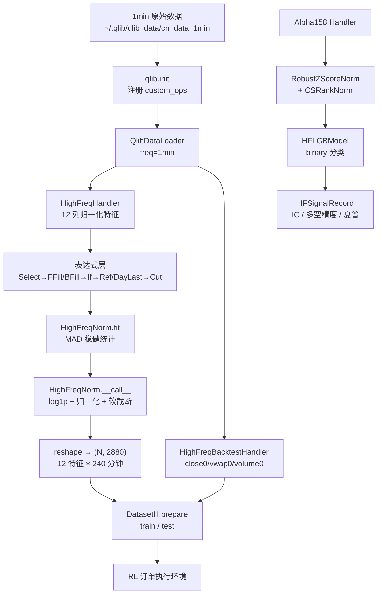

# Qlib 高频（High-Frequency）示例详解

本文逐文件、逐行逻辑地解析 `examples/highfreq` 目录，说明 1 分钟级高频数据在 Qlib 中是如何被**加载 → 表达式计算 → 归一化 → 组装成数据集 → 训练/评估**的。

---

## 0. 目录总览

| 文件 | 作用 |
|---|---|
| [workflow.py](qlib/examples/highfreq/workflow.py) | 示例入口。构建高频 `DatasetH`，演示获取数据、序列化（dump）、反序列化（load）、重初始化（reinit） |
| [highfreq_handler.py](qlib/examples/highfreq/highfreq_handler.py) | 两个 Handler：`HighFreqHandler`（训练特征）、`HighFreqBacktestHandler`（回测用原始价量） |
| [highfreq_ops.py](qlib/examples/highfreq/highfreq_ops.py) | 7 个自定义表达式算子：`DayLast/FFillNan/BFillNan/Date/Select/IsNull/Cut` |
| [highfreq_processor.py](qlib/examples/highfreq/highfreq_processor.py) | `HighFreqNorm` 处理器：稳健归一化 + 软截断 + reshape 成 RL 执行器要的形状 |
| [workflow_config_High_Freq_Tree_Alpha158.yaml](qlib/examples/highfreq/workflow_config_High_Freq_Tree_Alpha158.yaml) | 另一条独立路线：用 Alpha158 + LightGBM 预测分钟级涨跌方向 |
| [README.md](qlib/examples/highfreq/README.md) | 官方简要说明与 benchmark 结果 |

这个目录实际上包含**两个互不依赖的例子**：

1. **高频数据集示例**（`workflow.py` 一条线）——为强化学习订单执行（RL order execution）准备的数据管道，不训练模型。
2. **高频价格趋势预测示例**（YAML 一条线）——标准 `qrun` 流程，Alpha158 特征 + LightGBM 二分类。

---

## 1. 运行方式

```bash
cd examples/highfreq

# 例1：下载 1min 数据并跑通数据集构建
python workflow.py get_data

# 例1：序列化 / 反序列化 / 重初始化
python workflow.py dump_and_load_dataset

# 例2：LightGBM 预测分钟级趋势
qrun workflow_config_High_Freq_Tree_Alpha158.yaml
```

`fire.Fire(HighfreqWorkflow)` 把类的公开方法自动暴露成子命令，所以 `python workflow.py get_data` 等价于调用 `HighfreqWorkflow().get_data()`。

---

## 2. 高频数据的三个核心难点

在读代码前先明确高频场景相对日频多出来的问题，后面所有"看起来很绕"的表达式都是为了解决它们：

| 难点 | 表现 | 本例的解法 |
|---|---|---|
| **停牌/无成交分钟** | 分钟 bar 大量为 `NaN`，且停牌日整天无效 | `Select` 过滤 `$paused`，`FFillNan/BFillNan` 前后向填充 |
| **跨日不可比** | 分钟价格绝对值不同股票/不同日差异巨大 | 用「前一日收盘」`Ref(DayLast($close), 240)` 做分母归一化 |
| **窗口边界** | 归一化要用前一日数据，首日无前值 | `Cut(..., 240, None)` 砍掉最前面 240 分钟（1 个交易日） |

> 关键常数 **240**：A 股一个交易日 = 4 小时 = 240 分钟。因此 `Ref(x, 240)` 表示"前一个交易日的同一分钟"。

---

## 3. `highfreq_ops.py` — 自定义算子

Qlib 的表达式引擎只认识内置算子（`Ref/Mean/If/Gt/...`）。高频场景需要额外能力，本文件通过继承 `ElemOperator`（单目）与 `PairOperator`（双目）扩展。

### 3.1 `DayLast` — 取当日最后值

```python
def _load_internal(self, instrument, start_index, end_index, freq):
    _calendar = get_calendar_day(freq=freq)
    series = self.feature.load(instrument, start_index, end_index, freq)
    return series.groupby(_calendar[series.index], group_keys=False).transform("last")
```

`get_calendar_day` 把分钟级日历映射成"日期数组"（见 [high_freq.py](qlib/qlib/contrib/ops/high_freq.py)，带 `MemCache` 缓存）。按日期 `groupby` 后 `transform("last")`，让**当天每一分钟都持有当天收盘值**。

配合 `Ref(DayLast($close), 240)` 就得到"前一交易日收盘价"，这是全部价格归一化的分母。

### 3.2 `FFillNan` / `BFillNan` — 前向/后向填充

分别是 `series.ffill()` 和 `series.bfill()`。组合成 `BFillNan(FFillNan(x))` 可以填掉序列中间和开头的 `NaN`。

### 3.3 `Date` — 取日期

返回每个索引点对应的日期序列，本例中主要供扩展使用。

### 3.4 `Select` — 条件筛选（双目）

```python
series_condition = self.feature_left.load(...)
series_feature  = self.feature_right.load(...)
return series_feature.loc[series_condition]
```

左表达式是布尔条件，右表达式是取值。用法：

```
Select(Or(IsNull($paused), Eq($paused, 0.0)), $close)
```

含义：**只保留未停牌（`$paused == 0` 或字段缺失）的分钟的 `$close`**，停牌分钟直接从索引里剔除，随后由 `FFillNan` 补回。

### 3.5 `IsNull` — 缺失判定

返回 `series.isnull()` 布尔序列，供 `If(IsNull(x), a, b)` 使用。

### 3.6 `Cut` — 掐头去尾

```python
def __init__(self, feature, l=None, r=None):
    if (l is not None and l <= 0) or (r is not None and r >= 0):
        raise ValueError("Cut operator l should > 0 and r should < 0")
```

`Cut(x, 240, None)` 删除**原始数据**（非切片后数据）最前面 240 个点。

关键在 `get_extended_window_size`：

```python
lft_etd, rght_etd = self.feature.get_extended_window_size()
lft_etd = lft_etd + ll
rght_etd = rght_etd + rr
```

它告诉引擎"我需要额外向左多取 `l` 条数据"，从而保证 `Ref(..., 240)` 在请求区间的第一天也能拿到前一日数据，避免边界 `NaN`。**这是 `Cut` 存在的真正原因**——不是为了裁剪结果，而是为了正确声明窗口依赖。

### 3.7 注册方式

自定义算子必须在 `qlib.init` 时注册：

```python
SPEC_CONF = {
    "custom_ops": [DayLast, FFillNan, BFillNan, Date, Select, IsNull, Cut],
    "expression_cache": None,
}
```

注意 `expression_cache: None` **覆盖**了 `HIGH_FREQ_CONFIG` 里的 `"DiskExpressionCache"`——因为自定义算子的结果缓存容易与表达式字符串哈希冲突，示例中直接关闭。

---

## 4. `highfreq_handler.py` — 特征构造

### 4.1 `HighFreqHandler`（训练特征）

继承 `DataHandlerLP`（带 learn/infer 双处理链），数据源固定 `freq="1min"`：

```python
data_loader = {
    "class": "QlibDataLoader",
    "kwargs": {"config": self.get_feature_config(), "swap_level": False, "freq": "1min"},
}
```

`drop_raw=True` 表示处理完丢弃原始 DataFrame 以省内存。

#### 表达式模板

```python
template_if      = "If(IsNull({1}), {0}, {1})"
template_paused  = "Select(Or(IsNull($paused), Eq($paused, 0.0)), {0})"
template_fillnan = "BFillNan(FFillNan({0}))"
simpson_vwap     = "($open + 2*$high + 2*$low + $close)/6"
```

- `template_paused`：剔除停牌分钟
- `template_fillnan`：双向填充
- `template_if`：若目标字段缺失，退化用 `$close` 代替
- `simpson_vwap`：Yahoo 数据没有 vwap 字段，用**辛普森积分**权重 $\frac{o + 2h + 2l + c}{6}$ 近似

#### 价格归一化

```python
def get_normalized_price_feature(price_field, shift=0):
    if shift == 0:
        template_norm = "Cut({0}/Ref(DayLast({1}), 240), 240, None)"
    else:
        template_norm = "Cut(Ref({0}, " + str(shift) + ")/Ref(DayLast({1}), 240), 240, None)"
```

展开后的完整表达式（以 `$open` 为例）：

$$
\text{feature} = \mathrm{Cut}\left(\frac{\mathrm{If}(\mathrm{IsNull}(\tilde{o}),\ \tilde{c},\ \tilde{o})}{\mathrm{Ref}(\mathrm{DayLast}(\tilde{c}),\ 240)},\ 240,\ \mathrm{None}\right)
$$

其中 $\tilde{x} = \mathrm{BFillNan}(\mathrm{FFillNan}(\mathrm{Select}(\text{未停牌}, x)))$。

即：**清洗后的分钟价 ÷ 前一交易日收盘价**，结果是围绕 1.0 波动的相对价格，跨股票、跨日期可比。

#### 特征清单（共 12 列）

| 序号 | 名称 | 含义 |
|---|---|---|
| 0-4 | `$open $high $low $close $vwap` | 当日 T 时刻归一化价格 |
| 5-9 | `$open_1 $high_1 $low_1 $close_1 $vwap_1` | `Ref(..., 240)`，**前一交易日**同一时刻的归一化价格 |
| 10 | `$volume` | 当日归一化成交量 |
| 11 | `$volume_1` | 前一交易日归一化成交量 |

#### 成交量归一化与异常剔除

```python
"Cut({0}/Ref(DayLast(Mean({0}, 7200)), 240), 240, None)".format(
    "If(IsNull({0}), 0, If(Or(Gt({1}, Mul(1.001, {3})), Lt({1}, Mul(0.999, {2}))), 0, {0}))"...
)
```

两层逻辑：

1. **异常过滤**：若 `vwap > 1.001 × $high` 或 `vwap < 0.999 × $low`，说明该 bar 数据不一致（脏数据），把 volume 置 0。
2. **归一化**：除以 `Mean(volume, 7200)` 的前日值。`7200 = 240 × 30`，即**近 30 个交易日的分钟均量**。

注意 volume 缺失填 **0**（没成交就是 0），而不是像价格那样前向填充。

### 4.2 `HighFreqBacktestHandler`（回测原始量价）

继承的是 `DataHandler`（**无**处理器链），产出 3 列**未归一化**的真实值：

| 名称 | 表达式要点 |
|---|---|
| `$close0` | 清洗填充后的原始收盘价 |
| `$vwap0` | 收盘价缺失时用 simpson vwap 兜底 |
| `$volume0` | 同上的异常剔除逻辑，但不做均量归一化 |

**为什么要两套 Handler？** 模型吃归一化特征（可比、稳定），而回测撮合必须用真实价格计算成交金额与滑点。二者数据对齐但用途分离。

---

## 5. `highfreq_processor.py` — `HighFreqNorm`

这是本例最"重"的一步，做了三件事。

### 5.1 `fit`：在训练区间统计稳健参数

```python
fetch_df = fetch_df_by_index(df_features, slice(self.fit_start_time, self.fit_end_time), level="datetime")
names = {"price": slice(0, 10), "volume": slice(10, 12)}
```

前 10 列（价格）与后 2 列（成交量）**分组统计**，避免量纲互相污染。

对每组：

```python
if name == "volume":
    part_values = np.log1p(part_values)          # 成交量重尾 → log1p
self.feature_med[name] = np.nanmedian(part_values)
part_values = part_values - self.feature_med[name]
self.feature_std[name] = np.nanmedian(np.absolute(part_values)) * 1.4826 + EPS
```

使用 **MAD（中位数绝对偏差）** 而非标准差：

$$
\sigma_{\text{robust}} = 1.4826 \times \mathrm{median}(|x - \mathrm{median}(x)|)
$$

系数 1.4826 使 MAD 在正态分布下与标准差一致；中位数对高频尖峰/跳空**不敏感**，比 Z-Score 稳健得多。同时记录归一化后的 `vmax / vmin` 供后续软截断。

### 5.2 `__call__`：变换 + 软截断

```python
df_features["date"] = pd.to_datetime(...dt.date.values)
df_features.set_index("date", append=True, drop=True, inplace=True)
```

先把 `datetime` 拆出"日期"层，索引变成 `(instrument, datetime, date)`，为后面按天 reshape 做准备。

归一化后做**分段软截断**：

```python
slice0 = v > 3.0 ; slice1 = v > 3.5 ; slice2 = v < -3.0 ; slice3 = v < -3.5
v[slice0] = 3.0 + (v[slice0] - 3.0) / (vmax - 3) * 0.5
v[slice1] = 3.5
v[slice2] = -3.0 - (v[slice2] + 3.0) / (vmin + 3) * 0.5
v[slice3] = -3.5
```

含义：

- $|v| \le 3$：保持不变
- $3 < |v| \le v_{max}$：把 $(3, v_{max}]$ **线性压缩**到 $(3, 3.5]$
- 超出 `vmax` 的残余：硬截断到 $\pm 3.5$

相比直接 clip 到 ±3，这种做法**保留了极端值的相对序关系**（谁更极端仍然可分辨），对排序类任务更友好。

> 注意 `slice1` 在 `slice0` 之后执行，会覆盖 `slice0` 的部分结果——这是有意的兜底。

### 5.3 reshape：适配 RL 高频执行器

```python
idx = df_features.index.droplevel("datetime").drop_duplicates()
idx.set_names(["instrument", "datetime"], inplace=True)

feat   = df_values[:, [0, 1, 2, 3, 4, 10]].reshape(-1, 6 * 240)   # 当日 OHLCV+vwap
feat_1 = df_values[:, [5, 6, 7, 8, 9, 11]].reshape(-1, 6 * 240)   # 前日 OHLCV+vwap
df_new_features = pd.DataFrame(
    data=np.concatenate((feat, feat_1), axis=1),
    index=idx,
    columns=["FEATURE_%d" % i for i in range(12 * 240)],
).sort_index()
```

**形状变换**：从 `(股票数 × 天数 × 240分钟, 12列)` 的长表，变成 `(股票数 × 天数, 2880列)` 的宽表。

- 每行 = **一只股票的一整天**
- 2880 = 12 特征 × 240 分钟
- 前 1440 列是当日，后 1440 列是前一日

这正是 RL 订单执行环境需要的输入格式：一次拿到全天分钟序列作为状态。

---

## 6. `workflow.py` — 编排

### 6.1 初始化

```python
QLIB_INIT_CONFIG = {**HIGH_FREQ_CONFIG, **self.SPEC_CONF}
provider_uri = QLIB_INIT_CONFIG.get("provider_uri")
GetData().qlib_data(target_dir=provider_uri, interval="1min", region=REG_CN, exists_skip=True)
qlib.init(**QLIB_INIT_CONFIG)
```

`HIGH_FREQ_CONFIG` 定义于 [config.py](qlib/qlib/config.py#L309)：

```python
HIGH_FREQ_CONFIG = {
    "provider_uri": "~/.qlib/qlib_data/cn_data_1min",
    "dataset_cache": None,
    "expression_cache": "DiskExpressionCache",
    "region": REG_CN,
}
```

`dataset_cache: None` 是因为高频数据集体积过大，缓存收益为负。

### 6.2 日历预热

```python
def _prepare_calender_cache(self):
    Cal.calendar(freq="1min")
    get_calendar_day(freq="1min")
```

分钟级日历有数十万条，加载很慢。**在 fork 子进程之前**预加载进 `MemCache`，利用 Linux 的 copy-on-write 让所有子进程共享，避免每个进程重复计算。代码注释明确指出这在 Windows/macOS（spawn 模式）上无效。

### 6.3 双数据集配置

`task` 里同时定义 `dataset`（特征）与 `dataset_backtest`（回测量价），两者段划分一致：

```python
"segments": {
    "train": (start_time, train_end_time),      # 2020-09-15 ~ 2020-11-30
    "test":  (test_start_time, end_time),       # 2020-12-01 ~ 2021-01-18
}
```

### 6.4 `dump_and_load_dataset`：序列化与重初始化

```python
dataset.to_pickle(path="dataset.pkl")
...
with open("dataset.pkl", "rb") as f:
    dataset = restricted_pickle_load(f)
```

`DatasetH` 继承 `qlib.utils.serial.Serializable`，可以整体落盘。`restricted_pickle_load` 是**受限反序列化**，只允许白名单类，防止任意代码执行（pickle 反序列化是已知的 RCE 风险面）。

重初始化的意义在于：**复用已有的 handler 配置与状态，只换时间窗口**，用于滚动/在线推理：

```python
dataset.config(
    handler_kwargs={"start_time": "2021-01-19 00:00:00", "end_time": "2021-01-25 16:00:00"},
    segments={"test": ("2021-01-19 00:00:00", "2021-01-25 16:00:00")},
)
dataset.setup_data(handler_kwargs={"init_type": DataHandlerLP.IT_LS})
```

`IT_LS` = **I**nit **T**ype **L**earn + **S**hared，表示同时准备 learn 与 infer 两套数据。注意重载后必须**再次调用** `_prepare_calender_cache()`，因为反序列化不会恢复内存缓存。

---

## 7. YAML 路线 — Alpha158 + LightGBM 分钟趋势预测

这条线与上面完全独立，走标准 `qrun` 流程。

### 7.1 标签定义（最关键）

```yaml
label: ["Ref($close, -2) / Ref($close, -1) - 1"]
```

$$
y_t = \frac{P_{t+2}}{P_{t+1}} - 1
$$

**为什么是 -2/-1 而不是 -1/-0？** 因为 $t$ 时刻收盘产生信号，最快只能在 $t+1$ 开始交易。用 $t+1 \to t+2$ 的收益作为标签可以**避免前视偏差（look-ahead bias）**。

### 7.2 处理器链

```yaml
infer_processors:
    - class: 'RobustZScoreNorm'      # 稳健标准化（同样基于 MAD）
      kwargs: {fields_group: 'feature', clip_outlier: false}
    - class: "Fillna"
      kwargs: {fields_group: 'feature'}
learn_processors:
    - class: 'DropnaLabel'           # 丢弃无标签样本
    - class: 'CSRankNorm'            # 截面排序归一化
      kwargs: {fields_group: 'label'}
```

`CSRankNorm` 把标签转成截面分位，消除市场整体涨跌（beta）的影响，让模型专注学 alpha。

### 7.3 模型：`HFLGBModel`

见 [highfreq_gdbt_model.py](qlib/qlib/contrib/model/highfreq_gdbt_model.py)。相比普通 LightGBM 的特殊之处：

```python
df_train.loc[:, ("label", l_name)] = (
    df_train.loc[:, ("label", l_name)]
    - df_train.loc[:, ("label", l_name)].groupby(level=0, group_keys=False).mean()
)

def mapping_fn(x):
    return 0 if x < 0 else 1
df_train["label_c"] = df_train["label"][l_name].apply(mapping_fn)
```

**两步转换**：

1. 收益 → **alpha**（减去当期截面均值）
2. alpha → **二分类标签**（跑赢均值=1，跑输=0）

因此 YAML 里 `objective: binary`、`metric: [binary_logloss, auc]`。回归问题被转成了"是否跑赢市场"的分类问题，对高频噪声更鲁棒。

`hf_signal_test` 方法额外提供分位精度检验：取预测最高/最低 20% 的样本，统计其真实 alpha 的方向正确率。

### 7.4 记录器：`HFSignalRecord`

见 [record_temp.py](qlib/qlib/workflow/record_temp.py#L248)。除标准 IC/ICIR/Rank IC 外，额外产出：

- `Long precision` / `Short precision`：多空方向命中率（`is_alpha=True`，即以 0 为分界）
- `Long-Short Average Return` / `Sharpe`：多空组合收益与夏普

### 7.5 Benchmark

| Model | Dataset | IC | ICIR | Rank IC | Rank ICIR | Long prec. | Short prec. | LS Return | LS Sharpe |
|---|---|---|---|---|---|---|---|---|---|
| LightGBM | Alpha158 | 0.0349 | 0.3805 | 0.0435 | 0.4724 | 0.5111 | 0.5428 | 0.000074 | 0.2677 |

分钟级 IC 0.035 属正常水平——高频信噪比远低于日频，单笔收益 0.0074% 需要极低的交易成本才能覆盖。

---

## 8. 数据流全景图



---

## 9. 关键设计要点小结

1. **240 是一切的锚**。分钟数据的"昨日"就是 `Ref(x, 240)`，`Cut(..., 240, None)` 与 `get_extended_window_size` 配合保证边界正确。
2. **清洗链的顺序不能乱**：`Select`（去停牌）→ `FFillNan/BFillNan`（补缺）→ `If`（字段级兜底）→ 归一化 → `Cut`（去边界）。
3. **价格与成交量分开处理**：价格用前日收盘归一化、缺失前向填充；成交量用 30 日均量归一化、缺失填 0、先做 `log1p`。
4. **稳健统计代替标准差**：高频尖峰使均值/方差失效，MAD × 1.4826 是标配。
5. **软截断优于硬 clip**：极端值被压缩而非抹平，保留序信息。
6. **两套 Handler 分工**：归一化特征喂模型，真实量价喂回测。
7. **日历预热**：多进程前加载分钟日历，避免重复计算（仅 Linux 受益）。
8. **标签错位一格**：`Ref($close,-2)/Ref($close,-1)-1` 防前视偏差。
9. **回归转分类**：减截面均值得 alpha，再二值化，抵抗高频噪声。

---

## 10. 常见问题

**Q: 报错找不到 `DayLast` 等算子？**
A: 必须在 `qlib.init` 时传 `custom_ops`，且模块可被 import（`workflow.py` 依赖同目录的 `highfreq_ops.py`，需在该目录下运行）。

**Q: 为什么关掉 `expression_cache`？**
A: 自定义算子的缓存键基于表达式字符串，算子实现改动后缓存不会失效，容易读到脏数据。调试期建议保持 `None`。

**Q: 数据量太大内存不够？**
A: 减小 `instruments`（如从 `all` 改为 `csi300`）、缩短时间区间，或保持 `drop_raw=True`。

**Q: Windows 上很慢？**
A: `_prepare_calender_cache` 的 copy-on-write 优化只在 Linux fork 模式生效。Windows 下每个子进程都会重新加载分钟日历。可考虑减少 `kernels` 数量。
